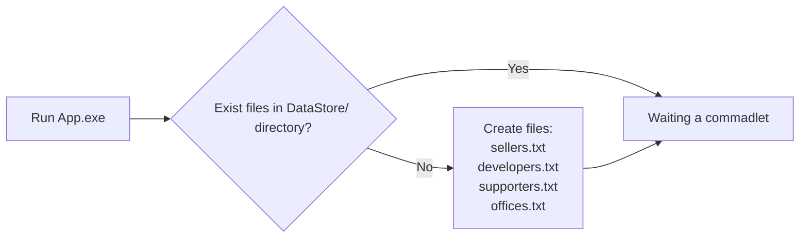
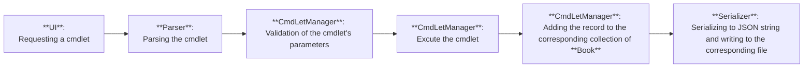
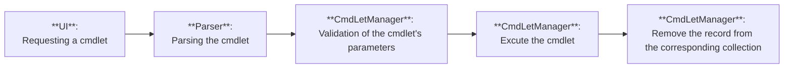
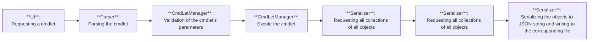
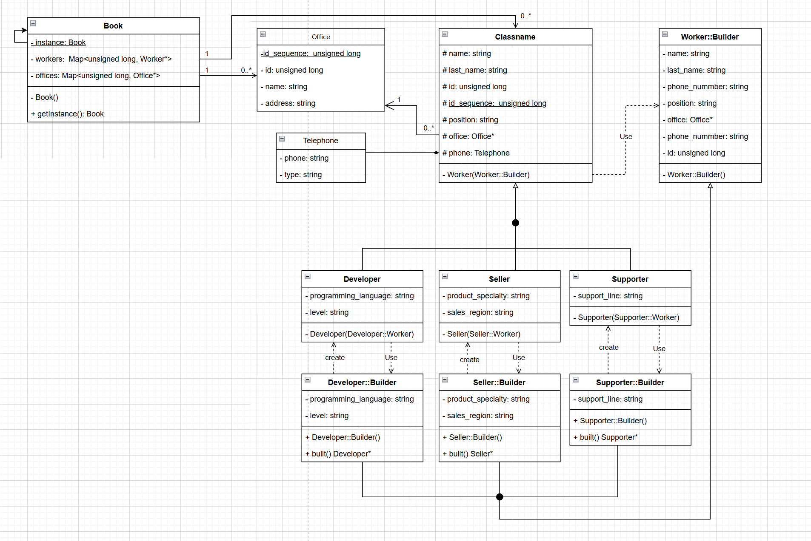

# Employee Address Book
- [Description](#description)
- [Release notes](#release-notes)
- [Cmdlets Tabel](#cmdlets-tabel)
- [Work Flow](##work-flow)
- [Diagram](#diagram)
## Description
Employee Address Book - консольное приложение для сохранения/удаления и отображения данных о сотрудниках. Взаимодействие с программой проходит посредством ввода комманд.
<br>[Полный список коммандлетов](#cmdlets-tabel)
## Release notes
- Поддерживаются только латинские и спец. символы таблицы ASCII. Это касается как названий коммандлетов/параметров так и самих значений. 
  <br>Использование других символов приведет к неверному форматированию таблиц или возникновению непредусмотренных исключений.
  
- Записи о сотрудниках или офисе сохраняется в "data store" сразу, после добавления. Удаление этих же записей, сохраняется только при выходе из программы через комманду `Exit`. 
  <br>Выход через закрытие консоли не зафиксирует удаление объектов за эту сессию.
  
- Рекомендуется развернуть консоль на весь экран, чтобы отображение таблиц было валидным.

## Cmdlets Tabel

| Командлет | Параметр | Описание |
|-----------|----------|----------|
| **Add-Dev** | `-n <обязательный>` | Имя разработчика |
|           | `-ln <обязательный>` | Фамилия разработчика |
|           | `-ph <необязательный; по умолчанию "-">` | Телефон |
|           | `-phtype <необязательный; по умолчанию "mobile">` | Тип телефона |
|           | `-o <необязательный; по умолчанию 0; int ≥ 0>` | ID офиса, `0` - это `No Office Assigned` для `Office Name` и `-` для `Office Address` |
|           | `-plang <необязательный; по умолчанию "unknown">` | Язык программирования |
|           | `-lvl <необязательный; по умолчанию "not assigned">` | Профессиональный уровень |
| **Add-Seller** | `-n <обязательный>` | Имя продавца |
|           | `-ln <обязательный>` | Фамилия продавца |
|           | `-ph <необязательный; по умолчанию "-">` | Телефон |
|           | `-phtype <необязательный; по умолчанию "mobile">` | Тип телефона |
|           | `-o <необязательный; по умолчанию 0; int ≥ 0>` | ID офиса |
|           | `-sr <необязательный; по умолчанию "not assigned">` | Регион продаж |
|           | `-ps <необязательный; по умолчанию "not assigned">` | Специализация по продукту |
| **Add-Support** | `-n <обязательный>` | Имя сотрудника поддержки |
|           | `-ln <обязательный>` | Фамилия |
|           | `-ph <необязательный; по умолчанию "-">` | Телефон |
|           | `-phtype <необязательный; по умолчанию "mobile">` | Тип телефона |
|           | `-o <необязательный; по умолчанию 0; int ≥ 0>` | ID офиса |
|           | `-sl <необязательный; по умолчанию "unknown">` | Линия поддержки |
| **Add-Office** | `-n <обязательный>` | Название офиса |
|           | `-adr <обязательный>` | Адрес офиса |
| **Get-All** | — | Показать всех сотрудников с краткой информацией |
| **Get-Devs** | — | Показать только разработчиков с подробной информацией, включая информацию про офис и деятельность |
| **Get-Sellers** | — | Показать только продавцов с подробной информацией, включая информацию про офис и деятельность |
| **Get-Supports** | — | Показать только сотрудников поддержки с подробной информацией, включая информацию про офис и деятельность |
| **Get-Offices** | — | Показать таблицу офисов |
| **Get-Help** | — | Показать подробную информацию о командлетах |
| **Remove-Employee** | `-id <обязательный; int ≥ 0>` | ID сотрудника для удаления |
| **Remove-Office** | `-id <обязательный; int ≥ 0>` | ID офиса для удаления. <br>При удалении офиса, все сотрудники, привязанные к этому офису получают `No Office Assigned` для `Office Name` и `-` для `Office Address` |
| **Exit** | — | Завершить приложение с сохранением данных |

## Work Flow

**Схема скомпилированного проекта:**
```
Build/
├─ ConsoleAddressBook.exe
├─ DataStore/
│   ├─ developers.txt
│   ├─ sellers.txt
│   ├─ supporters.txt
│   └─ get-help.txt
```
<br>`get-help.txt` - содержит краткую информацию о коммандах, которая выводится непосредственно в консоль.
<br>`developers.txt`, `sellers.txt`, `get-help.txt` - содержат сериализованные объекты соответствующих классов. 
<br>  Программа сохраняет данные в формате JSON объектов, с помощью библиотеки [niohmann/json](https://github.com/nlohmann/json?tab=readme-ov-file). 
<br>
<br>**Схема запуска приложения:**

<br>**Схема выполнения "Add-комманды"**


<br>**Схема выполнения "Remove-комманды"**

Как можно заметить, сохранение в файл не происходит.

<br>**Схема закрытия программы**



## Diagram


